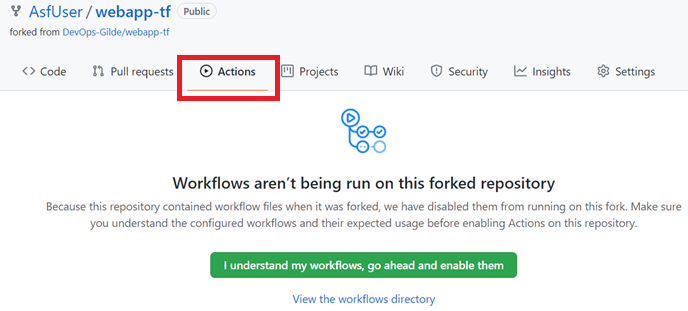
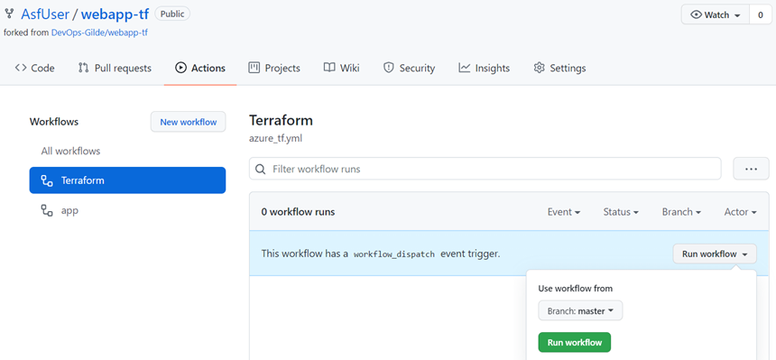
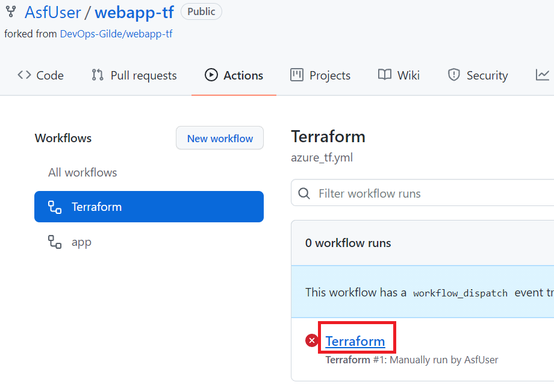
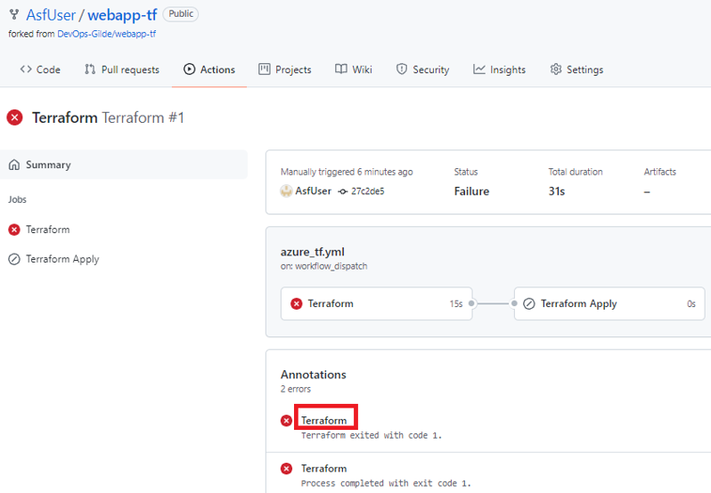

# How to work with GitHub

# GitHub Workflows with GitHub Actions

## Activate Workflows
When you fork a repository your workflows with GitHub Actions might not yet be activated. Click on the "Actions" tab in your GitHub repository.
Your workflows are not yet activated if you see a picture like below: 
 

To activate them click on the red marked button. As a result you should see now the workflows (=our pipelines) we already created for you. 
 

## Running Workflows
To run your pipelines successfully you have to implement the infrastructure pipeline first. A short explanation how to run a workflow when that is done. To run a workflow you first have to select the workflow you want to run at the left-hand side. You get then an additional button to run the workflow as shown below: 
 

## Troubleshooting
The picture below shows a failed pipeline run (Visible by the error icon): 
 

To figure out the reason click on the red marked link. You get now the the list of errors. Click again on the link to get the details including the error message:
 
 
