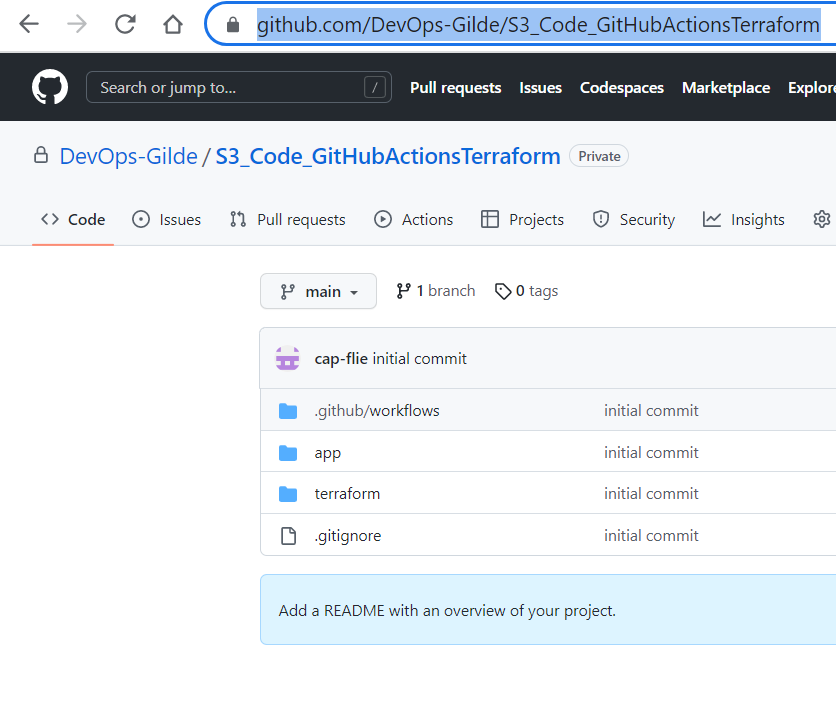
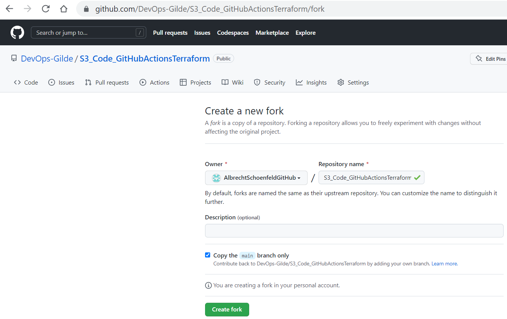
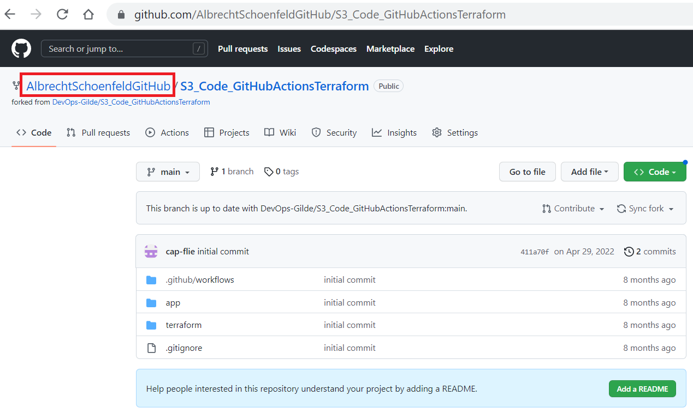
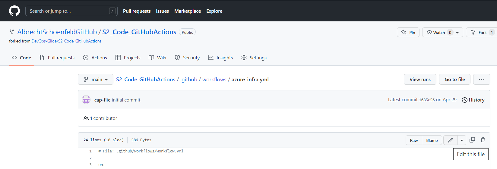

# 1. Introduction to Git Repositories

You should now have Completed the following things:
1. Setup your GitHub Account

Next you will you will create your Git repository within GitHub. Git is a version control system that developers use all over the world. It helps you track different versions of your code and collaborate with other developers. But Git is not just for code, it can be used for any kind of text document.

# 2. Setting up the GitHub Repository

## Overview

We created a repository in GitHub that is intended as starting point. This repository was created in a separate GitHub account named "DevOps-Gilde". Partially code changes are required from your side for setting up the infrastructure. Two steps are required:
1. Creating the repository in your GitHub account
2. Adjusting the code

For the second step various options exist:
- Using in-place editing with the browser within GitHub after import

  Only small code changes are required from your side. This is the **recommended method if you are not familiar with local code adjustment** via Visual Studio Code or comparable tooling.

- Using local tools to adjust the code

## How to create GitHub repository in your account

Run through the following steps to create the repo in your account:
1. Sign in into your GitHub account
2. Navigate to the repo we prepared for you
 Enter the URL https://github.com/DevOps-Gilde/S3_Code_GitHubActionsTerraform into the page as illustrated below
  

3. Fork the prepared repo into your account
 "Fork" means copy the source repository to start your own journey. Click on Fork on the top Right Corner as shown below:
  
The screenshot below shows the displayed screen where you can adjust the settings for the fork process. Uncheck the checkbox that limits the fork to the main branch only. The other defaults you leave as they are. Click on the button "Create fork" to start the process.
 

When the fork completed you are taken to the new repo in your GitHub account. The screenshot shows the resulting situation. Marked in red are important points:
- "AlbrechtSchoenfeldGitHub" is the example account we used for creating this documentation. You should see your GitHub account name instead, when you run it.
- "Main" denotes the current branch. Make sure you are working with this one and not with the already fully implemented solution.

  

## Recommended way: Adjusting Code (In-place GitHub Repo)

To adjust existing files select the file you want to edit. The screen below shows the resulting situation:
  

Use the "Edit" button at the right-hand side to switch into edit mode. An additional "Start Commit" button will appear at the right-hand side. Use this button to trigger the commit. Just go with the defaults after being prompted and to confirm.

## Optional: Adjusting Code (Locally in Visual Studio Code)

### Install Git and Visual Studio Code

Follow the installation wizards and use always defaults if being prompted. Visual Studio Code requires the additional installation of the Git extension.

### Clone GitHub repo to visual studio code

When opening a new Window of Visual Studio Code you will see the *Getting Started* page which offers you the option to *Clone Git Repository...*
  

When you click on this option a new window will open on the top where you can enter your *project url* from GitHub
  

After pressing *Enter*, you will be asked where to store the project on your computer.
  

After selecting a location, your Project will be copied to your computer and VS Code will offer you in the bottom right to open the cloned project.
  

You can either open the project in the current window or open it in a new window of VS Code.

### Work with Git

In the new window you will now see all files of the projects.

  

When you start working in the project, you will notice that the colour of the filenames will change to:

* Green *U* = New File
* Yellow *M*= Changed File
* Red *D*= Removed File
    
  The Change of colour shows you that Git has noticed that you changed a file in the project

When you now click again on the *Git symbol* on the left, you can see a list of all changed files.
  

When you select one of the files, Git will show you the difference between the last version of the file and the current file.
  

### Create a Commit

To finally save the changes and add a new version to git you need to make a commit which contains all changed files you want to bundle together. Therefore you need to select the changes you want to add by presseing the **plus** next to the filename. All added files are then displayed in the "Stage" area.

To create a commit which contains all staged files, you need to add a **Commit Message** and press *Enter* 
  

The *Commit* saves now all the changes made in the files and can be used to revert changes if needed.

### Pushing changes to the GitHub Repo

To save the changes in the cloud we need to push our commits to Github. Therefore you need to click on the three dots **...** in the top right of the git window.
In this Popup you can click in *Push* to upload your changes.
  

# Glossar

* Commit => Creates a bundle of all changes with a comment of what has been changed. It can be seen of a Snapshot of the project and its always possible to revert changes by jumping back to a older commit 
* Clone => Creates a copy of a remote project repository on your local machine. 
* Fork => Creates a copy of a git project. The copied version can be used to create customizations on a project. Hence the copy is still connected to the original project it is always possible to apply changes and updates into your customized version of the project. In contrast to clone the idea is to start a new separate journey.
* Push => Uploads all changes that have been made on the local project to a remote location (i.e. Github)
* Pull => Downloads all changes that have been made on the remote project since the last pull. This is needed when working with multiple people on one project so you always have the newest version on your local machine.

# More Information

* [Git Handbook](https://guides.github.com/introduction/git-handbook/)
* [Git Cheat Sheet](https://about.gitlab.com/images/press/git-cheat-sheet.pdf)

