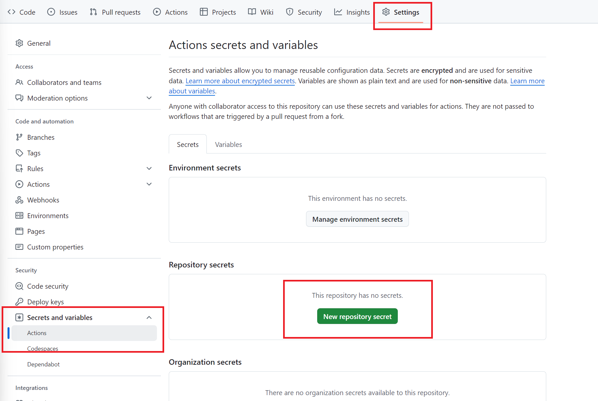
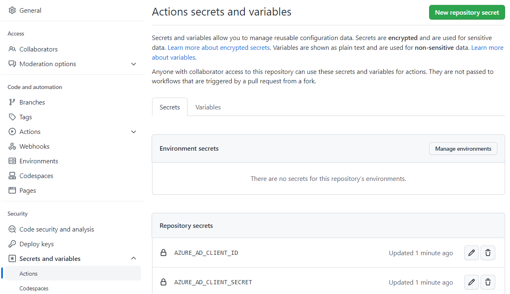
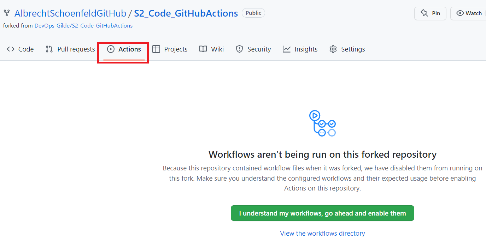
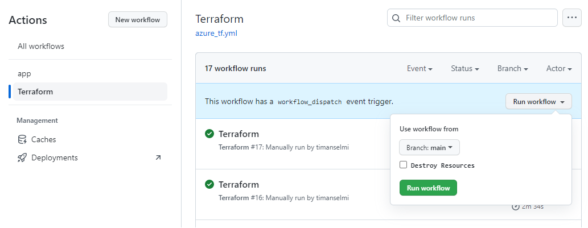
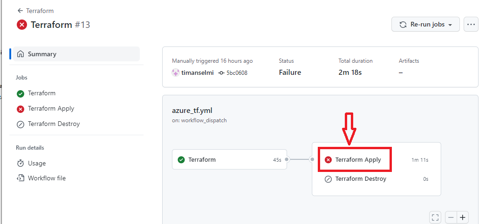
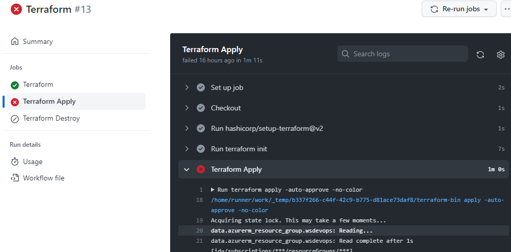
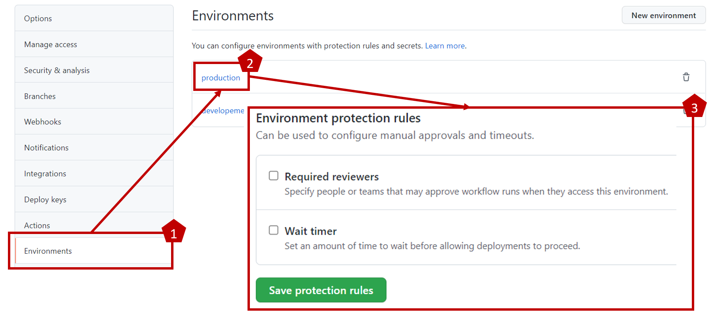

# 1. Introduction to the Infrastructure Workflow

You should now have Completed the Following things:
1. Setup your GitHub Account
2. Setup your Git Repository

Next you will create your own workflows to setup the azure services required for your Website on Azure. We will use the GitHub Repository to host the code for our workflows. A workflow consists of separate steps so called actions. Hence the name GitHub Actions. Workflows are the counterpart of Azure DevOps pipelines if you joined our previous session.

If you want to learn more about the concept of a workflow you can do it here:

[https://docs.github.com/en/actions/quickstart](https://docs.github.com/en/actions/quickstart)

# 2. Setting up the Infrastructure Workflow

## Introduction

Our workflow will use the code based approach. That means we will refer in our workflow to an existing YAML file in our repository. It defines the logical steps your workflow consists of. GitHub Actions allow to split a workflow in a hierarchy of jobs and steps.

A step has a certain type which defines what the step is about and which programing language you use inside the step. We will use **Azure CLI** as programming language. Azure CLI Docs: 
<br> https://docs.microsoft.com/de-de/cli/azure/what-is-azure-cli

Our YAML file will reference various things such as names for azure service instances we create, our subscription, a service principal and the resource group we want to deploy to. We will use secrets to store these values within our GitHub account and reference them in our YAML file.

## Create GitHub Secrets

To create secrets you first have to navigate to the right place in GitHub (Tab Settings => Entry "Actions" under Secrets => Button "New repository secret").

<br>

We all work in the same resource group and that's why we need naming conventions to ensure uniqueness. In our hackathon we will use simplifed ones but [here](https://docs.microsoft.com/de-de/azure/cloud-adoption-framework/ready/azure-best-practices/resource-abbreviations) you find recommendations for a real world case. The simplified naming schema we use partially is `<type-name>-<your personal identifier>`. A good idea is to use an akronym inferred from your name and a number. If your name is Florian Peters for Example you could choose:

`flopet631`

The full resource name for the app service plan could then be `plan-flopet631`. The following paragraphs list the secrets (Key-value pairs) you have to define. Click the "New repository secret" button as described above and confirm:

### AZURE_CREDENTIALS - Azure connection details

This is the Connection Data needed for the Azure Subscription. The hashtags are placeholders. Copy the values from the teams chat (They are not given to avoid exposure of secrets in the public internet).

Secrets:  
AZURE_AD_CLIENT_ID = \<Service Principal Id>  
AZURE_AD_CLIENT_SECRET = \<secret>  
AZURE_SUBSCRIPTION_ID = \<Sub-id>  
AZURE_AD_TENANT_ID = \<tenant-id>  


`AZURE_AD_CLIENT_ID` and `AZURE_AD_CLIENT_SECRET` deserve a quick extra explanation. A workflow changes things in your Azure subscription. Of course these changes must be associated with a user so that Azure can determine whether you have the permissions to do so. `AZURE_AD_CLIENT_ID` denotes the service principal we created beforehand for you. We gave that user permission for the resource group in which you deploy your Azure services. Of course a user also needs credentials. The value behind `AZURE_AD_CLIENT_SECRET` is exactly that.

### LOC - Geo-Location of the resources

This is the Azure location (also known as region) where resources are geographical deployed:

Secret:  
LOC = 
`westeurope`

> :warning: In case Azure returns an error regarding quota limitation please use a different location like `northeurope`

### RG - ResourceGroup name

This is the Name of the Resource Group you will be using to Deploy your Website. During the Hackathon you will only have Access to the Following ResourceGroup:

Secret:  
RG = `ws-devops`

If you want to know more about Resource Groups take a look here:
https://docs.microsoft.com/en-us/azure/azure-resource-manager/management/manage-resource-groups-portal#what-is-a-resource-group

### ASP - AppServicePlan name

This is the Name of the App Service Plan which needs to be unique in our Subscription.

Secret:  
ASP= `plan-<your personal identifier>`

If you want to know more about App Service Plans take a look here:
https://docs.microsoft.com/en-us/azure/app-service/overview

### WEBAPP - WebApplication name

This is the Name of the Web Application which needs to be unique globally. `<your personal identifier>` might be an option but you might have to modify it due to global uniqueness across the entire Azure.

Secret:  
WEBAPP= `<your web app name>`

If you want to know more about WebApps take a look here:
https://docs.microsoft.com/en-us/azure/app-service/overview

There is no way to display the secret value via the browser UI. As you can see in the screenshot below there is no view button.

<br>

However, we included a special debug step named `debug secrets` that outputs the secrets during a workflow run. The next chapter explains how the magic works.

## Overview YAML workflow file

The focus of this hackathon is on terraform. Therefore, we have already programmed all required steps in the yaml file `.github/workflows/azure_tf.yml`. But we also want to make sure you have a chance to understand the code. The next chapter explains major aspects what the steps in the code do. To learn more about the workflow syntax and jobs visit: https://docs.github.com/en/actions/reference/workflow-syntax-for-github-actions#jobs

The code file can be split in three major parts:
* Workflow Header
* Prepare Terraform code execution (init/ plan)

  _This step is implemented as a GitHub Actions job named `terraformprepare`._

* Execute Terraform code (apply)
  
  _This step is implemented as a GitHub Actions job named `terraformapply`._

* Destroy Terraform resources (destroy)
  
  _This step is implemented as a GitHub Actions job named `terraformdetroy`._

### Workflow Header

This includes the name (`name`) of the flow, passing our secrets as environment variables (`env`) and the condition under which our worklow is triggered (`on` which specifies manual start). When starting the workflow manually you can control enable the input field `destroy`.
```
name: 'Terraform'
 
on:
  workflow_dispatch:
    inputs:
      destroy:
        description: Destroy Resources
        default: false
        type: boolean
        required: true

env:
  # Login for azure cli
  ARM_CLIENT_ID: ${{ secrets.AZURE_AD_CLIENT_ID }}
  ARM_CLIENT_SECRET: ${{ secrets.AZURE_AD_CLIENT_SECRET }}
  ARM_SUBSCRIPTION_ID: ${{ secrets.AZURE_SUBSCRIPTION_ID }}
  ARM_TENANT_ID: ${{ secrets.AZURE_AD_TENANT_ID }}

  # Terraform variables
  TF_VAR_client_id: ${{ secrets.AZURE_AD_CLIENT_ID }}
  TF_VAR_client_secret: ${{ secrets.AZURE_AD_CLIENT_SECRET }}
  TF_VAR_subscription_id: ${{ secrets.AZURE_SUBSCRIPTION_ID }}
  TF_VAR_tenant_id: ${{ secrets.AZURE_AD_TENANT_ID }}
  TF_VAR_rg_name: ${{ secrets.RG }}
  TF_VAR_web_app_name: ${{ secrets.WEBAPP }}
  TF_VAR_app_service_plan_name: ${{ secrets.ASP }}
  TF_VAR_location: ${{ secrets.LOC }}
```
### Prepare Terraform code execution

The first section specifies properties of the job such as name (`name`), vm image (`runs-on`), working directory (`working-directory`)  and shell (`shell`).
```
...
jobs:
  terraformprepare:
    name: 'Terraform'
    runs-on: ubuntu-latest
    environment: development
 
    # Use the Bash shell regardless whether the GitHub Actions runner is ubuntu-latest, macos-latest, or windows-latest
    defaults:
      run:
        shell: bash
        working-directory: terraform
 
```

The next two steps ensure that terraform is installed and that our code is at the expected directory.
```
...
# Checkout the repository to the GitHub Actions runner
- name: Checkout
  uses: actions/checkout@v3

- uses: hashicorp/setup-terraform@v2
```

Now we run the standard terraform commands to init the environment and to calculate the result of the terraform code without actually deploying the resources by terraform plan. The generated execution plan `terraform plan` is machine readable and can be used in unit test scenarios. Especially if the deployment of a resource takes long this is a great advantage. Native Microsoft languages like `Bicep` don't provide such a feature yet.

The `fmt` command which does static code analysis and checks correct formatting.

```
    ...
    # Checkout the repository to the GitHub Actions runner
    - name: Checkout
      uses: actions/checkout@v3

    - uses: hashicorp/setup-terraform@v2

    - run: terraform init
    
    - name: Terraform fmt
      id: fmt
      run: terraform fmt -check

    - name: Terraform Plan
      id: plan
      run: terraform plan -no-color
```
An interesting detail of the `terraform plan` is the way how our secrets are passed. As stated by `env` each variable is passed as environment variable. For each passed variable a counterpart must be defined within terraform as you will see later. Matching between the variable in the env section and terraform code is done as follows:
* `TF_VAR_` is stripped off
* The remaining part such as `client_id` must be defined as terraform variable

`terraform plan` needs access to the terraform code to be executed. In our case the terraform code is located in a subdirectory why we need to define the `working-directory` for **all upcoming Terraform Tasks** (Location working directory: https://github.com/DevOps-Gilde/S3_Code_GitHubActionsTerraform/tree/main/terraform). 

The setup from the second job is not much different from the first one. Only the terraform commands within the steps differ. 
```
 ...
 terraformapply:
    if: ${{ github.event.inputs.destroy == 'false' }}
    name: 'Terraform Apply'
    needs: [terraformprepare]
    runs-on: ubuntu-latest
    environment: production
 
    # Use the Bash shell regardless whether the GitHub Actions runner is ubuntu-latest, macos-latest, or windows-latest
    defaults:
      run:
        shell: bash
        working-directory: terraform

    steps:
    # Checkout the repository to the GitHub Actions runner
    - name: Checkout
      uses: actions/checkout@v3
      
    - uses: hashicorp/setup-terraform@v2

    - run: terraform init
    - name: Terraform Apply
      id: apply
      # if: github.ref == 'refs/heads/main'
      run: terraform apply -auto-approve -no-color
...
```


The second job needs to wait until the first one completed. Sequential execution is enforced by `needs: [terraform]`. Additionally it is only running, if workflow parameter `destroy` is not activated (`if: ${{ github.event.inputs.destroy == 'false' }}`) when starting the workflow. 
The parameter `-auto-approve` in `terraform apply -auto-approve` ensures that your workflow is not hanging because terraform expects a manual confirmation from the user.

Finally the third job `terraformdetroy` removes all azure resources created by your terraform code. Destroying the deployed infrastructure is achieved by calling `terraform destroy`

```
...
  terraformdestroy:
    if: ${{ github.event.inputs.destroy == 'true' }}
    name: 'Terraform Destroy'
    needs: [terraform]
    runs-on: ubuntu-latest
    environment: production
 
    # Use the Bash shell regardless whether the GitHub Actions runner is ubuntu-latest, macos-latest, or windows-latest
    defaults:
      run:
        shell: bash
        working-directory: terraform

    steps:
    # Checkout the repository to the GitHub Actions runner
    - name: Checkout
      uses: actions/checkout@v2
      
    - uses: hashicorp/setup-terraform@v2

    - run: terraform init
    
    - name: Terraform Destroy
      id: destroy
      # if: github.ref == 'refs/heads/main'
      run: terraform destroy -auto-approve -no-color
```

# 2. Terraform Tasks

## Terraform settings

Every terraform project needs a backend to store the state by default a Local file will be used but there are many different available backends. In our case we have already provided you with an azure storage account and a container in which the state file resides.
However, it is your job to provide a unique name for the state file in `main.tf`. If it doesnt exist it will be created by the Terraform CLI. 
The name of the placeholder `<your unique name>` needs to be unique for every participant. (only Lowercase and numbers allowed)

```
terraform {
  backend "azurerm" {
    resource_group_name  = "ws-devops"
    storage_account_name = "cgmsgtf"
    container_name       = "tfstateazdevops"
    key                  = "<your unique name>.tfstate"
  }
}
```

### Storage Account

To learn more about Azure Storage Accounts checkout:  
https://docs.microsoft.com/de-de/azure/storage/common/storage-account-overview
### Backends

To learn more about Terraform Backends checkout:  
https://www.terraform.io/docs/language/settings/backends/index.html

### State

To learn more about the Terraform State Checkout:  
https://www.terraform.io/docs/language/state/index.html

## Input variables

In the github actions workflows we passed input parameters to terraform. Currently the counterpart in terraform is missing. It is good practice to declare the input variables for a module (here main.tf) in a separate file. Therefore, add an additional file in the same folder as `main.tf` named `variables.tf`. Add the following code:

```
variable "client_id" {
  description = "Application id from app registration in azure active directory."
  type        = string
}

variable "client_secret" {
  description = "Client secret from app registration in azure active directory."
  type        = string
}

variable "subscription_id" {
  description = "Subscription id of resource group."
  type        = string
}

variable "tenant_id" {
  description = "Tenant id of subscription."
  type        = string
}

variable "rg_name" {
  description = "The name of the resource group."
  type        = string
}

variable "web_app_name" {
  description = "The name of the web app."
  type        = string
}

variable "app_service_plan_name" {
  description = "The name of the app service plan."
  type        = string
}

variable "location" {
  description = "location where to deploy resources to"
  type        = string
}

```
The variables are needed for the optional monitoring task, too.

## Data and Resource

As you probably know most of the deployed Azure resources reside in a resource group. We created that resource group already for you to reduce administrative efforts. The other Azure resources inside the resource group have to be created by your code. This distinction between existing resources and to be created ones is also reflected in the terraform code. The keyword `data` denotes an existing resources you want to read for later reference in your code. Resources to be managed by terraform are denoted by the keyword `resource`. As explained in the introduction terraform adjusts these resources so that they match the target state you define in the terraform code. Both data and resources can have mandatory and optional properties.

So let's add the required code for reading the resource group and its property for later reference. To do so add the following code to `main.tf` file.
```
#Get resource group
data "azurerm_resource_group" "wsdevops" {
  name = var.rg_name
}

```
`name` is a mandatory property in this case. It is needed by terraform to know which resource group you are referring to. 
Variable references in terraform have the format `var.<name of your variable>`. In this case we have defined the variable `rg_name` in file `variables.tf`. The value of this variable is assigned in the pipeline env section ( `TF_VAR_rg_name: ${{ secrets.RG }}` ). The actual value comes from the defined secret `RG`. 

More about Azure Resource Groups:
https://docs.microsoft.com/de-de/azure/azure-resource-manager/management/manage-resource-groups-portal

More About Terraform Resource Group Definitions:

https://registry.terraform.io/providers/hashicorp/azurerm/latest/docs/resources/resource_group

## App Service Plan

In the Next Step you define your desired Azure App Service Plan

For Location and Resource Group Name we use the previus gathered information from the Resource Group Data Definition.

For our example we want a Linux App Service Plan with the SKU STANDARD S1

To do so add the following code to `main.tf` file.

```
resource "azurerm_app_service_plan" "sp1" {
  name                = var.app_service_plan_name
  location            = var.location
  resource_group_name = data.azurerm_resource_group.wsdevops.name
  kind                = "Linux"
  reserved            = true

  sku {
    tier = "Standard"
    size = "S1"
  }
}

```
Again we use variables to used our defined values for `name` and `location`. The name of the resource group is now referenced via the previously defined data object. 

More about Azure App Service Plan:

https://docs.microsoft.com/de-de/azure/app-service/overview-hosting-plans


More about Terraform App Service Plan Definition:


https://registry.terraform.io/providers/hashicorp/azurerm/latest/docs/resources/app_service_plan

## App Service

For the App Service Definition we need a Site Configuration of "NODE|10-lts". As `name` and and `location` we use the values of the secrets that were passed as input variables.  


The Website Content will be added later over a second Pipeline.

To do so add the following code to `main.tf` file.

```
resource "azurerm_app_service" "website" {
  name                = var.web_app_name
  location            = var.location
  resource_group_name = data.azurerm_resource_group.wsdevops.name
  app_service_plan_id = azurerm_app_service_plan.sp1.id

  site_config {
    linux_fx_version = "NODE|10-lts"
    scm_type         = "LocalGit"
  }
}
```

More about App Services:
https://registry.terraform.io/providers/hashicorp/azurerm/latest/docs/resources/app_service
## Commit and push to git

After you have saved your changes you have to commit and push it to your repository.  
Check chapter "Create a Commit": How to use Git Locally [here](01.5_SetupGit.md)  

# 3. Run your workflow

## Start your workflow

After you set up your Secrets and fixed the code in your Repository you are ready to run your workflow.
To do so go to the ",Actions" tab. GitHub Actions are disabled by default in your fork. Click the button "I understand my workflows..." as shown below.

<br><br>

Now you see a typical main detail screen with the available workflows on the left-hand side. Select the "Terraform" workflow and click on the "Run workflow" button. In the screenshot previous runs existed already. Click on run to see the results or for troubleshooting.

<br><br>

For troubleshooting just click on the name "Terraform" next to the icon error icon. The "Terraform" run at the bottom of the previous screenshot for instance. The next two screenshots show the remaining two levels until you hit the details.

<br><br>
<br><br>

## Workflow Progress

Wait for your Workflow to finish.
If the Task does not run through try to figure out the problem yourself by following the troubleshooting information above. Of course we are there to help if you don't find a solution.
## Check your WebApp is online after approx. 5 minutes

https://`[yourWebAppName]`.azurewebsites.net/

You should see a &quot;Your web app is running and waiting for your content&quot; welcome screen.

Congratulations, you have deployed your first WebApp infrastructure. Now, you can go ahead and deploy some code to your WebApp.

## Manual Approval

In the apply statement you might have noticed the environment property as shown below:
```
...
terraformapply:
  ...
  environment: production
```
In the GitHub portal you can now register additional persons that act as additional approver for the named environment. The screenshot below shows the relevant section under settings:
<br><br>

Once you configure a person the workflow won't proceed until that other person has approved.That was all what we wanted demonstrate. Thanks for staying with us up to now.