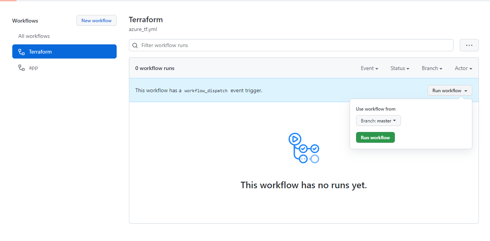

# Infrastructure Repository and Pipeline

## Introduction

You should now have completed the following things:
1. Setup your GitHub Account
2. Setup the example code in your account
3. Activated the workflows in your repository in GitHub

Next you will get an overview over the example code to setup your first own Website on Azure via Terraform. This will only be the most basic infrastructure setup. If you want to learn more about the concept of a pipeline you can do it here:

[https://docs.github.com/en/actions/quickstart](https://docs.github.com/en/actions/quickstart)

Creating infrastructure with terraform in github actions consists of two major steps:
1. Workflow (=Yml file)
 
    The focus of this hackathon is on terraform. Therefore, we have already programmed all required steps. But we also want to make sure you have a chance to understand the code. The next chapter therefore explains in detail what the steps in the code do.

2. Terraform (=Files with extension tf)

    This part **contains all tasks to implement**.

# 1. Primer Workflow

The first Step in Creating a Pipeline with GitHub Actions would normally be to select a Template and start from there.

To do so you would go to Actions in your code repository and select an appropriate template or start from Scratch with an empty one.

In our example we already created the necessary files. So to say our own template.

Your first task is to go into your repository and look at the following file.

>_Warning: The formatting of YAML (yml) files is based on spaces and tabs and therefore the following lines should be copied with care.
> It is advised to use Visual Studio Code to validate the copied file._
> <br> [How to work with Git Locally](/01.5_SetupGit.md)


`#File: .github/workflows/azure_tf.yml`
```
name: 'Terraform'
 
on:
  workflow_dispatch

env:
  ARM_CLIENT_ID: ${{ secrets.AZURE_AD_CLIENT_ID }}
  ARM_CLIENT_SECRET: ${{ secrets.AZURE_AD_CLIENT_SECRET }}
  ARM_SUBSCRIPTION_ID: ${{ secrets.AZURE_SUBSCRIPTION_ID }}
  ARM_TENANT_ID: ${{ secrets.AZURE_AD_TENANT_ID }}

jobs:
  terraform:
    name: 'Terraform'
    runs-on: ubuntu-latest
    environment: developement
 
    # Use the Bash shell regardless whether the GitHub Actions runner is ubuntu-latest, macos-latest, or windows-latest
    defaults:
      run:
        shell: bash
        working-directory: terraform
 
```

## Azure Cli

The pipeline we are proposing here is using Terraform to create a App Service Plan on Azure.

Github Terraform Doc: 
<br> https://github.com/hashicorp/setup-terraform

Azure AppServicePlan and WebApp: 
<br> https://docs.microsoft.com/en-us/azure/app-service/overview

## Pipeline Name

Next we specify the Name of our GitHub Action in our Example "`name: Terraform`".

## Triggers

The code starts by using "`on: workflow_dispatch`" which means one of the triggers to start this pipeline is to do it manually.

There are many automatic triggers you can use, to learn more about triggers check this:
https://docs.github.com/en/actions/reference/events-that-trigger-workflows#workflow_dispatch

## Environment Variables:

The environment variables are set in the code runners the pipeline uses. In our example these are known variables by terraform which it uses to authenticate against Azure.
## Code runner

After we define the triggers and the name of the workflow we need to specify its "`jobs`".
In our example we split the Pipeline into two Jobs "`terraform`" and "`terraformapply`".

This is done to allow for manual Approval. More on that later.

Next we Specify what image we Expect our job to run on:
"`runs-on: ubuntu-latest`"

```
jobs:

  deploy:
    runs-on: ubuntu-latest
    
```

## Defaults

In our case the terraform code is located in a subdirectory why we need to define the "`working-directory`" for all upcoming Terraform Tasks. 

To learn more about the workflow syntax and jobs visit:
https://docs.github.com/en/actions/reference/workflow-syntax-for-github-actions#jobs

## Deployment of AppService and WebApp

Next the script manages Terraform with the build in Terraform CLI "`uses: hashicorp/setup-terraform@v1`".
```
    - name: Checkout
      uses: actions/checkout@v2

    - uses: hashicorp/setup-terraform@v1

    - run: terraform init
    
    - name: Terraform fmt
      id: fmt
      run: terraform fmt -check
      # Due to unresolveable problems with variable.tf files.
      # If you can figure out what is wrong let us know
      continue-on-error: true

    - name: Terraform Plan
      id: plan
      run: terraform plan -no-color
      env:
        TF_VAR_client_id: ${{ secrets.AZURE_AD_CLIENT_ID }}
        TF_VAR_client_secret: ${{ secrets.AZURE_AD_CLIENT_SECRET }}
        TF_VAR_subscription_id: ${{ secrets.AZURE_SUBSCRIPTION_ID }}
        TF_VAR_tenant_id: ${{ secrets.AZURE_AD_TENANT_ID }}

```

## Checkout

Checkout gets the branch from Github onto the worker.
As the worker is created everytime from scratch every job needs to get the sources again.

## Terraform cli

`   - uses: hashicorp/setup-terraform@v1`
Defines the Builtin commands to be available on the worker from GitHub.

The CLI documentation can be found here.
https://learn.hashicorp.com/tutorials/terraform/azure-build?in=terraform/azure-get-started

## Terraform init

Terraform init sets up the current project environment and connects to the Azure Storage Account Defined in your "`terraform/main.tf`"

## Terraform fmt
Terraform fmt allows you to format your Code automatically so it matches the expected Syntax. It beautyfies your code aswell for better readablity. 

Normally you would set "`continue-on-error: false`" so you get automatic linting and the pipeline doesnt allow incorrect formatted code. Unfortuately we could not figure out why terraform is complaining about the certain things you introduce later on such as variables. Therefore set "`continue-on-error: true`" to ensure your code is running through. If you figure out what is the correct required formatting let us know, so that we can drop this workaround.

## Terraform Plan
Creates a plan of the changes needed to be done on Azure to accomplish the defined settings in your terraform code.

The `env:` subsection is responsible for initializing variables that are defined in our terraform module `main.tf`.
```
    - name: Terraform Plan
      ...
      env:
        TF_VAR_client_id: ${{ secrets.AZURE_AD_CLIENT_ID }}
        TF_VAR_client_secret: ${{ secrets.AZURE_AD_CLIENT_SECRET }}
        TF_VAR_subscription_id: ${{ secrets.AZURE_SUBSCRIPTION_ID }}
        TF_VAR_tenant_id: ${{ secrets.AZURE_AD_TENANT_ID }}
        TF_VAR_web_app_name: ${{ secrets.WEBAPP }}
```
The variable name follows the following special convention: `TF_VAR_<name of your var in terraform>`. Terraform then automatically maps the value to the terraform variable.

## Dependencies and Environments

You can setup concurrent or sequential tasks with Pipelines. In our example we made a sequential task by definining that the second task needs the first:

"`needs: [terraform]`"

Also we setup two different Environments "production" and "developement" those are necessary for an Approval Workflow. More on that later.

## Terraform apply

The final Step is to apply the terraform code which will setup the defined environment on Azure.

As in the plan command you have to add variables in the `env:` subsection.

## Terraform main.tf

Your /terrform/main.tf contains all the setting for the desired infrastructure on Azure. It will be the major file where you have to implement things.

# 2. Terraform Tasks

## Terraform settings

Every terraform project needs a backend to store the state by default a Local file will be used but there are many different available backends. In our case we have already provided you with an azure storage account and a container in which the state file resides.
However, it is your job to provide a unique name for the state file in `main.tf`. If it doesnt exist it will be created by the Terraform CLI. 
The name of the placeholder `<your unique name>` needs to be unique for every participant. (only Lowercase and numbers allowed)

```
terraform {
  backend "azurerm" {
    resource_group_name  = "ws-devops"
    storage_account_name = "cgmsgtf"
    container_name       = "tfstateazdevops"
    key                  = "<your unique name>.tfstate"
  }
}
```

### Storage Account

To learn more about Azure Storage Accounts checkout:

https://docs.microsoft.com/de-de/azure/storage/common/storage-account-overview
### Backends

To learn more about Terraform Backends checkout:
https://www.terraform.io/docs/language/settings/backends/index.html

### State

To learn more about the Terraform State Checkout:
https://www.terraform.io/docs/language/state/index.html

## Input variables

In the github actions workflows we passed input parameters to terraform. Currently the counterpart in terraform is missing. It is good practise to declare the input variables for a module (here main.tf) in a separate file. Therefore, add an additional file in the same folder as `main.tf` named `variables.tf`. Add the following code:

```
variable "client_id" {
  description = "Application id from app registration in azure active directory." 
  type        = string
}

variable "client_secret" {
  description = "Client secret from app registration in azure active directory." 
  type        = string
}

variable "subscription_id" {
  description = "Subscription id of resource group." 
  type        = string
}

variable "tenant_id" {
  description = "Tenant id of subscription." 
  type        = string
}

variable "web_app_name" {
  description = "The name of the web app." 
  type        = string
}

```
The variables are needed for the optional monitoring task.

## Data and Resource

As you probably know most of the deployed Azure resources reside in a resource group. We created that resource group already for you to reduce administrative efforts. The other Azure resources inside the resource group have to be created by your code. This distinction between existing resources and to be created ones is also reflected in the terraform code. The keyword `data` denotes an existing resources you want to read for later reference in your code. Resources to be managed by terraform are denoted by the keyword `resource`. As explained in the introduction terraform adjusts these resources so that they match the target state you define in the terraform code. Both data and resources can have mandatory and optional properties.

So let's add the required code for reading the resource group and its property for later reference. To do so add the following code to `main.tf` file.
```
#Get resource group
data "azurerm_resource_group" "wsdevops" {
  name = "ws-devops"
}

```
`name` is a mandatory property in this case. It is needed by terraform to know which resource group you are refering to.

More about Azure Resource Groups:
https://docs.microsoft.com/de-de/azure/azure-resource-manager/management/manage-resource-groups-portal

More About Terraform Resource Group Definitions:

https://registry.terraform.io/providers/hashicorp/azurerm/latest/docs/resources/resource_group

## App Service Plan

In the Next Step you define your desired Azure App Service Plan

For Location and Resource Group Name we use the previus gathered information from the Resource Group Data Definition.

For our example we want a Linux App Service Plan with the SKU STANDARD S1

To do so add the following code to `main.tf` file.

```
resource "azurerm_app_service_plan" "sp1" {
  name                = "<your unique service plan name>"
  location            = data.azurerm_resource_group.wsdevops.location
  resource_group_name = data.azurerm_resource_group.wsdevops.name
  kind                = "Linux"
  reserved            = true

  sku {
    tier = "Standard"
    size = "S1"
  }
}

```

More about Azure App Service Plan:

https://docs.microsoft.com/de-de/azure/app-service/overview-hosting-plans


More about Terraform App Service Plan Definition:


https://registry.terraform.io/providers/hashicorp/azurerm/latest/docs/resources/app_service_plan

## App Service

For the App Service Definition we need a Site Configuration of "NODE|10-lts". As name we use the value of the secret that was passed as input variable.  
Variable references in terraform have the format `var.<name of your variable>`.

The Website Content will be added later over a second Pipeline.

To do so add the following code to `main.tf` file.

```
resource "azurerm_app_service" "website" {
  name                = var.web_app_name
  location            = data.azurerm_resource_group.wsdevops.location
  resource_group_name = data.azurerm_resource_group.wsdevops.name
  app_service_plan_id = azurerm_app_service_plan.sp1.id

  site_config {
    linux_fx_version = "NODE|10-lts"
    scm_type         = "LocalGit"
  }
}
```

More about App Services:
https://registry.terraform.io/providers/hashicorp/azurerm/latest/docs/resources/app_service
## Commit and push to git

After you have saved your changes you have to commit and push it to your repository.  
Check chapter "Create a Commit": How to use Git Locally [here](01.5_SetupGit.md)  

# 3. Run your Pipeline

After you set up your secrets and fixed the code in your repository.
You can try to run your workflow.
To do so go to Actions and select the terraform workflow on the Left site.

Now select run workflow on the right side.

<br><br>

## Workflow Progress

Wait for your Workflow to finish.
If the task does not run through you may ask one of us to help you out.
## Check your WebApp is online after approx. 5 minutes

https://`[yourWebAppName]`.azurewebsites.net/

You should see a &quot;Hey, Node developers&quot; welcome screen.

Congratulations, you have deployed your first WebApp infrastructure.

## Manual Approval

We have not yet answered the question regarding manual approval. In the apply statement you might have noticed the environment property as shown below:
```
...
terraformapply:
  ...
  environment: production
```
In the GitHub portal you can now register additional persons that act as additional approver for the named environment. The screenshot below shows the relevant section under settings:
<br><br>

Once you configure a person the workflow won't proceed until that other person has approved.That was all what we wanted demonstrate. Thanks for staying with us up to now.