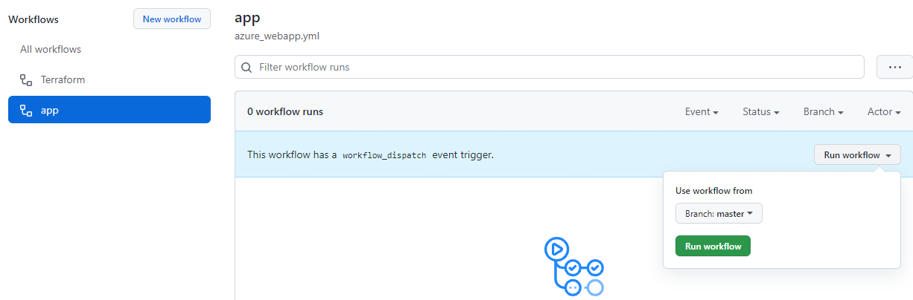

# Infrastructure Repository and Pipeline

## Introduction

You should now have Completed the Following things:
1. Setup your GitHub Account
2. Setup the Example Code in your Account
3. Added the Repository Secrets to the Example Code
4. Setup the initial WebApp on Azure

The explanations shall help you to create the website via GitHub Actions. 
All required code is already there since the focus of this session is terraform. No further actions are required apart from starting the workflow.

# Run your Pipeline

To do so go to Actions and select the app workflow on the Left site.

Now Select Run workflow on the Right side.

  

## Workflow Progress

Wait for your Workflow to finish.
If the Task does not run through you may ask one of us to Help you out.
## Check your WebApp is online after approx. 2 minutes

https://`[yourWebAppName]`.azurewebsites.net/

You should see a &quot;Hey, Node developers&quot; welcome screen.

Congratulations, you have deployed your first WebApp via GitHub Actions and terraform.
 